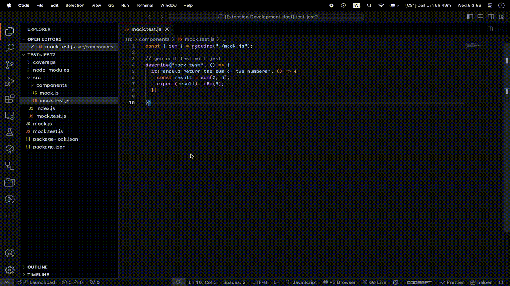

# just-run-jest

This extension is a simple extension that allows you to run jest tests from the command palette.

## Features

- Quickly run Jest tests with the shortcut `ctrl+alt+j`.

## Extension Settings

The extension offers the following settings::

- `runCommand`: Configure the command to run Jest tests. For example: `npm test -- "$testFile" "--coverage" "--collectCoverageFrom=$collectFrom"`.
